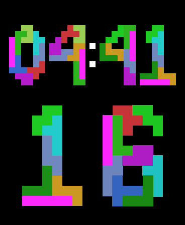
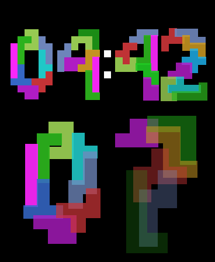

PentoFace
=========

# Introduction
This is a simple apple watch face app which uses Swift and UIKit to make a beautiful
Pentominoes-themed watch face, and is also intended to be used a as proof-of-concept
to try to convince apple to support third party watch faces on the watch App Store.

Secondarily, it is indended to promote the creator's other app, Pictominoes, available
on the App Store and Google Play:

App Store: https://apps.apple.com/us/app/pictominoes/id1453077424

Google Play: https://play.google.com/store/apps/details?id=com.okidokico.pictominoes

# Instructions
Fire up the latest XCode, open the project, select an apple watch simulator, or a real one, and press play!

# License
This software was created by Nicholaos Mouzourakis, who has made it a part of the public domain.
See the License for details.

# Screenshots

